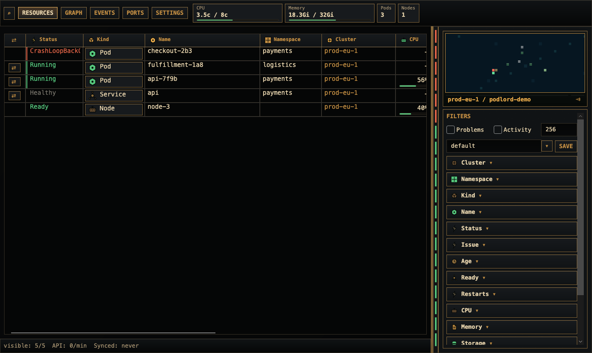
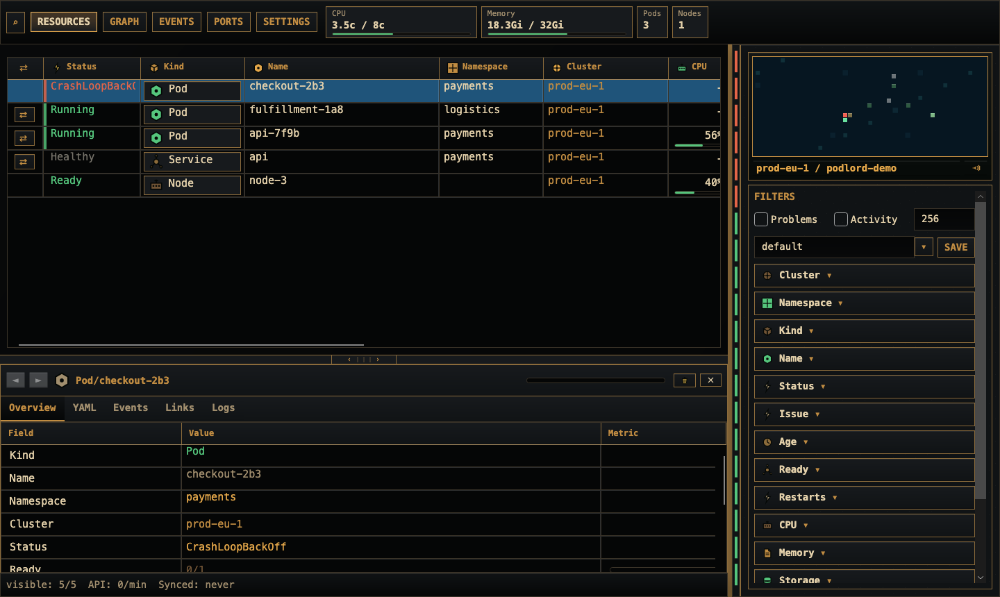

# Podlord

> Rule your clusters before they rule you.

[](https://github.com/YunaBraska/podlord/actions/workflows/ci.yml)
[](https://github.com/YunaBraska/podlord/actions/workflows/release.yml)
[](LICENSE)

Podlord is a native desktop Kubernetes operations console for people who want a fast, flat, cache-first view of their clusters instead of another namespace tree with a YAML drawer stapled to it.

It is built with C#/.NET, Avalonia UI, and a direct Kubernetes API client. Normal app operations do not depend on a preconfigured shell context and do not call `kubectl`; kubeconfigs are imported into Podlord-owned snapshots so sessions stay explicit and repeatable.

## Screenshots





Captures are produced from a real Avalonia render via `PODLORD_CAPTURE_SCREENSHOTS=1 dotnet test tests/Podlord.App.LayoutTests/Podlord.App.LayoutTests.csproj --filter Capture_resource_explorer`.

## Highlights

- Flat resource explorer across namespaces by default
- Multi-source kubeconfig import from home config, custom file, directory scan, pasted YAML, or generated k3d config
- Cache-first Kubernetes reads with request queueing, backoff, API audit log, and configurable hard request cap
- Sortable, resizable, reorderable, and hideable resource/event tables
- Searchable multi-select filters with exact, contains, starts-with, ends-with, regex, numeric, and duration expressions
- Radar view with deterministic resource island layout, panning, zooming, selection, activity markers, and optional water animation
- Resource inspector with overview metrics, YAML editing/apply, related events, links, logs where supported, ConfigMap/Secret key tables, delete actions, and native port forwarding where supported
- CPU and memory usage from `metrics.k8s.io`, including namespace-scoped fallback when cluster-wide pod metrics are forbidden
- Native cross-platform port forwarding through Kubernetes streaming APIs; `kubectl` is not required for the app path
- Secret values are hidden by default, redacted from YAML output, and copied only through explicit user action
- Localized application chrome with English fallback
- Disposable k3d integration tests for real Kubernetes behavior

## Install

Download the latest archive for your platform from [GitHub Releases](https://github.com/YunaBraska/podlord/releases).

Release assets are built for:

| Platform | Architectures | Asset |
|---|---:|---|
| macOS | arm64, x64 | `.app` bundle inside `.zip` |
| Linux | x64, arm64 | portable `.tar.gz` |
| Windows | x64, arm64 | portable `.zip` |

Each release also includes `SHA256SUMS` for archive verification.

macOS builds are ad-hoc signed but not notarized. Without an Apple Developer license, opening the app can be nasty: Gatekeeper may require right-click Open, Privacy & Security approval, or removing quarantine on the downloaded app.

Open on macOS:

1. Unzip the release.
2. Move `Podlord.app` to `/Applications`.
3. Right-click `Podlord.app`, then choose `Open`.
4. If blocked, allow Podlord in `System Settings -> Privacy & Security`.
5. Last resort: `xattr -dr com.apple.quarantine /Applications/Podlord.app`.

## Run From Source

Podlord pins its SDK in [global.json](global.json). If you do not have a matching .NET SDK installed, bootstrap the local toolchain:

```sh
scripts/bootstrap-dotnet.sh
```

Run the app:

```sh
.tools/dotnet/dotnet run --project src/Podlord.App/Podlord.App.csproj
```

Start with a specific kubeconfig:

```sh
.tools/dotnet/dotnet run --project src/Podlord.App/Podlord.App.csproj -- /absolute/path/to/kubeconfig
```

The app imports kubeconfigs into its own store. The original file is not modified by normal use.

## Test

```sh
scripts/test.sh
```

The test script:

1. Ensures Docker or Colima is available.
2. Installs pinned k3d and kubectl versions into `.tools/bin` when missing.
3. Creates a disposable k3d cluster.
4. Runs the .NET test suite with coverage.
5. Enforces coverage gates.

Current gates:

- Line coverage: 95%
- Branch coverage: 80%

The gate targets domain, persistence, Kubernetes, filtering, sync, and alert-rule behavior. Thin Avalonia presentation adapters and native UI/audio wrappers are excluded from the numeric gate and covered by focused behavior/layout tests where useful.

The k3d scenario map is documented in [doc/spec/k3d-test-map.md](doc/spec/k3d-test-map.md).

## Build Release Archives Locally

```sh
scripts/publish.sh all
scripts/publish.sh linux-x64
scripts/publish.sh linux-musl-arm64
scripts/publish.sh win-x86
scripts/build-macos-app.sh macos-arm64
```

Supported runtime identifiers:

- `macos-arm64`
- `macos-x64`
- `linux-x64`
- `linux-arm64`
- `linux-arm`
- `linux-musl-x64`
- `linux-musl-arm64`
- `linux-musl-arm`
- `win-x64`
- `win-x86`
- `win-arm64`

## Release Flow

Merging to `main` runs the release pipeline:

1. test with the k3d-backed suite
2. create a date version like `2026.6.15`
3. build platform archives for Linux, macOS, and Windows across the 11 supported runtimes (x64, x86, arm, arm64; glibc and musl)
4. zip Windows archives, tar.gz everything else, and generate `SHA256SUMS` across the full set
5. update the changelog release section, push the release commit, create the tag, and publish the GitHub release with notes extracted from the changelog

Manual workflow dispatch is available for dry runs or a custom date tag, but normal releases are branch-driven.

## Project Layout

```text
src/Podlord.Core        Domain model, settings, kubeconfig import, filters, health, command risk model
src/Podlord.Kubernetes  Kubernetes API adapter, auth, metrics, resource details, logs, port-forwarding
src/Podlord.App         Avalonia desktop shell, radar, tables, filters, inspector, themes
tests/                  Public-boundary behavior tests and k3d integration tests
doc/adr/                Architecture decision records
doc/spec/               Product, roadmap, and scenario notes
doc/design/             Design system notes and assets
```

## Security And Privacy

- Telemetry is disabled by default.
- Kubeconfig contents, tokens, certificates, and raw secret values are not logged.
- Imported kubeconfigs are stored as app-owned snapshots.
- Secrets are displayed as metadata/key lists first; values require explicit reveal/copy.
- Kubernetes RBAC failures are surfaced as visibility/freshness states instead of being hidden.

See [SECURITY.md](SECURITY.md) for vulnerability reporting.

## Roadmap

The next major feature area is rule-based alerting:

- user-defined alert rules over resources, fields, filters, events, and metrics
- reusable default rules that replace today’s built-in activity/problem behavior
- custom radar animations for matched rules
- optional error, warning, and info sounds
- import/exportable rule presets
- per-rule enable/disable controls

See [doc/ROADMAP.md](doc/ROADMAP.md) for the full plan.

## Contributing

Pull requests are welcome. Please read [CONTRIBUTING.md](CONTRIBUTING.md) before sending one. The short version: keep behavior explicit, test through public boundaries, do not leak secrets, and do not bypass the Kubernetes request queue.

By contributing you agree to follow the [Code of Conduct](CODE_OF_CONDUCT.md).

## Support The Project

Podlord is a one-human side project with no funding or corporate backer. If it earned a place on your dock, the easiest way to help is a star on the repository. If you want to fuel a coffee, any of these work:

- [GitHub Sponsors](https://github.com/sponsors/YunaBraska)
- [Buy Me a Coffee](https://buymeacoffee.com/YunaBraska)
- [Ko-fi](https://ko-fi.com/YunaBraska)
- [Liberapay](https://liberapay.com/YunaBraska)

Bugs, ideas, and rants are equally welcome on the [issue tracker](https://github.com/YunaBraska/podlord/issues/new).

## License

Podlord is licensed under the [MIT License](LICENSE).
