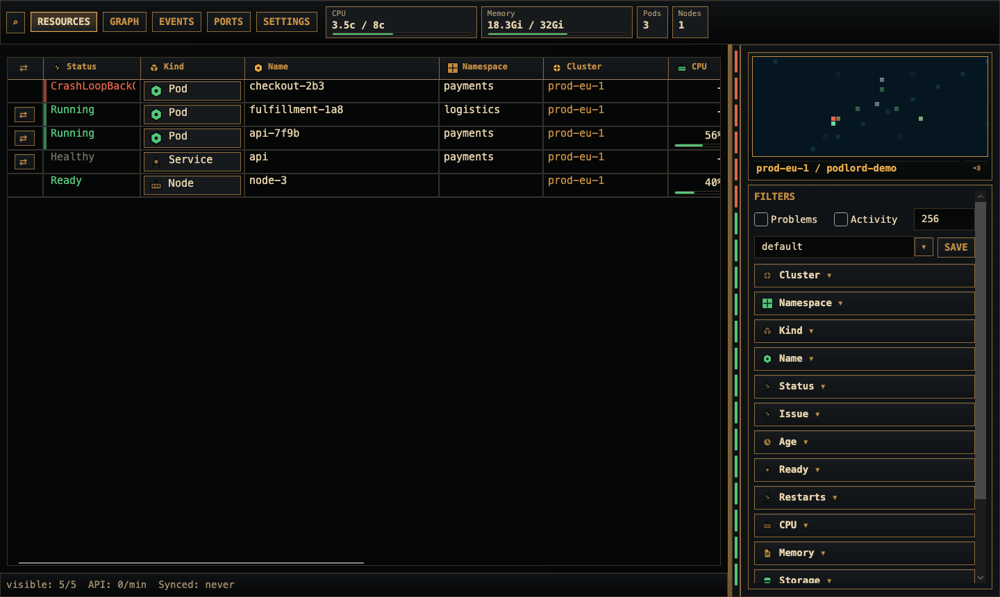
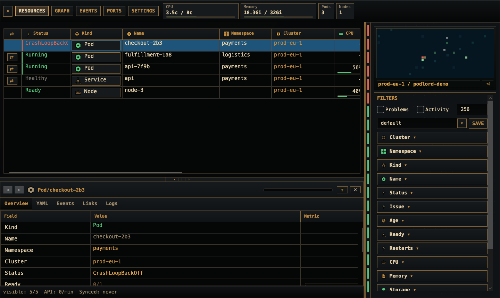

# Podlord Behavior Roadmap

This document describes Podlord as a buildable product specification: what the app does, how each behavior should work, what order to build it in, and which tests prove it.

It is intentionally more detailed than the README. The README is the 30-second entry point. This file is the behavior map.

## Evidence Base

The current behavior is derived from:

| Source | Purpose |
|---|---|
| [`../README.md`](../README.md) | Public product summary, install, build, release, and test commands. |
| [`../doc/spec/product-brief.md`](../doc/spec/product-brief.md) | Original product intent and user experience goals. |
| [`../doc/spec/podlord-operational-spec.md`](../doc/spec/podlord-operational-spec.md) | Current operational model and safety constraints. |
| [`../doc/spec/feature-inventory.md`](../doc/spec/feature-inventory.md) | Snapshot of implemented features. |
| [`../doc/spec/alert-automation.md`](../doc/spec/alert-automation.md) | Alert rule model, matchers, actions, and sound policy. |
| [`../doc/spec/k3d-test-map.md`](../doc/spec/k3d-test-map.md) | Real Kubernetes and performance test map. |
| [`../doc/design/podlord-style-guide.md`](../doc/design/podlord-style-guide.md) | Visual language and theme constraints. |
| [`../doc/screenshots/resource-explorer.png`](../doc/screenshots/resource-explorer.png) | Rendered resource explorer screenshot. |
| [`../doc/screenshots/inspector-settings.png`](../doc/screenshots/inspector-settings.png) | Rendered inspector and filter screenshot. |
| [`../src/Podlord.Core`](../src/Podlord.Core) | Domain model, settings, kubeconfig import, filters, health, alerts. |
| [`../src/Podlord.Kubernetes`](../src/Podlord.Kubernetes) | Kubernetes API, cache, metrics, logs, YAML apply, delete, port-forward. |
| [`../src/Podlord.App`](../src/Podlord.App) | Avalonia UI shell, view models, radar, filters, tables, settings. |
| [`../tests`](../tests) | Behavior, layout, fake Kubernetes, k3d, and performance budget tests. |

Screenshots:

## Product Definition

Podlord is a native desktop Kubernetes operations console.

The app must be:

- flat by default, with resources visible across namespaces before the user filters down
- source/session explicit, so the user always knows which kubeconfig and context are active
- cache-first, so UI operations read local snapshots and Kubernetes calls fill the cache in the background
- API-native, so normal app operations do not require `kubectl`
- dense and readable, with a modern operations UI and subtle late-1990s RTS influence
- safe around secrets, kubeconfigs, destructive actions, and wrong-context operations

## Build Order

Build Podlord in this order. Each milestone should leave the app usable.

| Milestone | Build Result |
|---:|---|
| 1 | Desktop shell, persisted settings, themes, localization, and app state. |
| 2 | Kubeconfig import, source snapshots, sessions, source selector, tabs, windows. |
| 3 | Kubernetes API service, request queue, cache, audit log, diagnostics. |
| 4 | Flat resource explorer with sorting, columns, quick search, filters, saved filters. |
| 5 | Metrics pulse layer, health segments, readiness/problem/activity model. |
| 6 | Radar island, water/idle layers, pan/zoom, selection, hover, alert visuals. |
| 7 | Inspector with overview, YAML, events, links, logs, values, actions. |
| 8 | Graph and Events workspaces with search, sorting, focus, and alert visuals. |
| 9 | Native port-forwarding and Ports workspace. |
| 10 | Alert automation editor, sounds, mute, preview, deduplication. |
| 11 | Packaging, update checks, Homebrew, release archives, README polish. |
| 12 | Full k3d, layout, performance, and regression test hardening. |

## Global Principles

### Cache First

The UI reads cached snapshots first. Kubernetes requests are background work unless the user explicitly opens details, logs, YAML apply, delete, or port-forward.

Required behavior:

- Resource table, graph, radar, filters, events, and pulse strip render from local cache.
- User filter changes apply immediately without a Kubernetes request.
- User quick search applies immediately without a Kubernetes request.
- Opening a resource shows cached detail first when available, then fetches fresh detail.
- Logs fetch only when the selected resource supports logs and the Logs tab is active.
- YAML tab does not get overwritten by background refresh while the user is editing.
- A first cold load must not show partial resource rows or a live radar until the broad cache warmup completes.
- A warm session switch may show cached rows immediately while background sync continues.

Evidence:

- [`../src/Podlord.Kubernetes/KubernetesResourceService.cs`](../src/Podlord.Kubernetes/KubernetesResourceService.cs)
- [`../src/Podlord.App/MainWindowViewModel.cs`](../src/Podlord.App/MainWindowViewModel.cs)
- [`../tests/Podlord.App.Tests/AppBehaviorTests.cs`](../tests/Podlord.App.Tests/AppBehaviorTests.cs)
- [`../tests/Podlord.App.Tests/PerformanceBudgetTests.cs`](../tests/Podlord.App.Tests/PerformanceBudgetTests.cs)

### Source And Session Explicitness

Every visible view is bound to a Podlord session, and every session comes from an imported kubeconfig context.

Required behavior:

- The source/context name is visible under the radar.
- The window title reflects the active session.
- Session tabs show open sessions.
- A session can be open only once across all windows.
- Opening an already-open session focuses the existing tab/window instead of duplicating it.
- Detaching a tab to a new window removes that session from the previous window.
- A detached window keeps the same cache source but independent UI state.
- Source selector hides sessions already opened in tabs/windows.

Evidence:

- [`../src/Podlord.App/AppRuntime.cs`](../src/Podlord.App/AppRuntime.cs)
- [`../src/Podlord.App/WorkspaceModels.cs`](../src/Podlord.App/WorkspaceModels.cs)
- [`../tests/Podlord.App.LayoutTests/AppRuntimeHeadlessTests.cs`](../tests/Podlord.App.LayoutTests/AppRuntimeHeadlessTests.cs)

### No Hidden Shell Context

Podlord must not silently depend on the user's current shell kube context.

Required behavior:

- Kubeconfigs are imported into Podlord-owned snapshots.
- Original kubeconfig files are not mutated by normal app use.
- File-backed kubeconfigs are watched/polled for changes and reimported into the same source identity.
- Virtual sources from pasted/generated kubeconfig text are not treated as refreshable files.
- Kubernetes operations use the app-managed source/session binding.
- `kubectl` is not required for listing, detail, logs, YAML apply, delete, metrics, or port-forward.

Evidence:

- [`../src/Podlord.Core/AppState.cs`](../src/Podlord.Core/AppState.cs)
- [`../src/Podlord.Core/KubeconfigImporter.cs`](../src/Podlord.Core/KubeconfigImporter.cs)
- [`../src/Podlord.Kubernetes/KubernetesResourceService.cs`](../src/Podlord.Kubernetes/KubernetesResourceService.cs)

## Milestone 1: Desktop Shell And Settings

### Goal

Create the persistent Avalonia desktop shell with navigation, theme system, localization, settings, update affordance, and footer status.

### UI Contract

Top bar:

- update/download button, visible only when a newer GitHub release exists
- quick search button
- workspace navigation: Resources, Graph, Events, Ports, Settings
- pulse strip with compact metric plaques
- open session tabs when multiple sessions are open

Main shell:

- central workspace area
- resizable right command column containing radar and filters
- vertical health segment bar beside the radar/filter column
- bottom inspector, hidden until a resource/source/action opens it
- footer with visible row count, API requests per minute, and sync age

Settings:

- Appearance
- Graphics
- Sync
- Workspace
- Privacy
- Sources
- Alerts
- Diagnostics
- About

Settings defaults:

| Setting | Default |
|---|---|
| Theme | `Sirocco Command` |
| Theme variant | `dark` |
| Pixel effect intensity | `18` |
| Animation intensity | `60` |
| Landing view | `resources` |
| Namespace scope | all namespaces |
| Workspace restore | enabled |
| Secret reveal policy | explicit reveal |
| Telemetry | disabled |
| Screensaver | enabled |
| Radar water | disabled |
| Radar water speed | `0` |
| Inactive sync | disabled |
| Request hard limit | none |
| Language | system |

Theme catalog:

- Imperial Ledger
- Sirocco Command
- Ironwood Warroom
- Gunmetal Sector
- Chitin Brood
- Prism Ascendant
- Ion Front
- Crimson Bunker
- Machine Wargrid
- Emerald Frontline
- Steel Lance
- Neon Directorate
- Xeno Bureau
- Atomic Terminal
- Metrogrid Classic
- Railnet Ledger
- Stellar Senate
- Nocturne Basic
- Daylight Basic

### Acceptance Criteria

- App starts with empty state without crashing.
- App can start with a kubeconfig path argument.
- Theme, language, graphics, sync, workspace, privacy, and table layout settings persist.
- Top navigation active state updates when workspaces change.
- Update button is hidden unless the latest release is newer than the current version and has a usable asset URL.
- About page shows the current application version.
- Localization updates visible labels without restart where supported.

### Verification

- Layout tests for top navigation, About bindings, and settings.
- Behavior tests for update checks, version comparison, update asset selection, and env-disabled checks.

## Milestone 2: Kubeconfig Sources And Sessions

### Goal

Give Podlord its own source/session model independent of shell state.

### Source Import Behavior

Supported source inputs:

| Input | Behavior |
|---|---|
| home kubeconfig | imported automatically from `$HOME/.kube/config` or `PODLORD_HOME/.kube/config` in tests |
| file path | import exactly that file |
| directory path | recursively scan up to 32 levels for kubeconfig-like files |
| pasted YAML | import as virtual source |
| generated k3d kubeconfig | import as generated virtual source |
| empty import field | open file/folder picker |

Directory scan recognizes kubeconfig-like names, including:

- `config`
- `*.kubeconfig`
- `*.config`
- `*.cfg`
- `*.kube`
- `*.yaml`
- `*.yml`

It must ignore obvious non-kubeconfig files such as shell scripts, hidden files, and markdown notes.

### Snapshot Behavior

Every imported file-backed kubeconfig:

- is parsed and validated
- is copied into the app config directory under `kubeconfigs/`
- gets a stable content hash from kubeconfig YAML content
- gets a stable source identity from path plus context identity
- preserves original source file untouched
- updates the existing source when the file changes
- removes stale contexts/sessions when a changed source no longer contains them
- deduplicates identical contexts by source path/name or by content hash plus context identity
- preserves user metadata, including display name, filter assignment, safety value, and last-opened timestamp where applicable

Virtual sources:

- use `podlord-paste://...` or `podlord-generated://...`
- are app-owned from creation
- are not refreshed from disk

### Session Behavior

For each imported context, Podlord creates or preserves a session.

Session fields:

- session id
- display name
- context reference
- cluster reference
- namespace scope
- safety level
- optional color/icon fields
- created timestamp

Source-specific metadata:

- display name
- source name
- source path
- owned kubeconfig path
- content hash
- auth type
- default filter name
- last opened timestamp
- broken reference warnings

Source list behavior:

- sorted by last opened/updated activity first
- rename editable inline
- delete removes imported context and related sessions
- filter assignment editable inline
- blank name resets to kubeconfig context name
- default filter fallback is always `default`
- source selector hides already-open sessions

### Acceptance Criteria

- Importing the same kubeconfig twice does not duplicate sources.
- Reimporting a changed file updates the existing source even if the UI display name was renamed.
- Importing a folder finds valid kubeconfigs below it and ignores unrelated files.
- Removing an imported source removes its sessions and unused app-owned snapshot files.
- Last opened time persists and controls ordering after restart.
- Broken kubeconfig references are visible instead of silently disappearing.

### Verification

- Core import tests for file, text, generated, duplicate, broken references, path normalization, and stale context removal.
- App behavior tests for source list ordering, rename, filter assignment, directory import, file refresh, missing source status, and duplicate suppression.

## Milestone 3: Kubernetes API, Cache, Queue, Diagnostics

### Goal

Build an API-native Kubernetes data layer with queueing, throttling, caching, diagnostics, and safe failures.

### Resource Kinds

Core supported kinds:

- Namespace
- Node
- Pod
- Service
- ConfigMap
- Secret
- PersistentVolume
- PersistentVolumeClaim
- ServiceAccount
- Event
- Deployment
- ReplicaSet
- StatefulSet
- DaemonSet
- Job
- CronJob
- Ingress
- NetworkPolicy
- EndpointSlice
- Gateway
- HTTPRoute
- GRPCRoute

Optional APIs:

- Gateway resources may be absent and should not fail the whole refresh.
- Metrics APIs may be absent and should render neutral metric state.

Forbidden APIs:

- must surface as explicit forbidden/freshness failures when relevant
- must not crash the whole refresh

### Request Queue Behavior

The request layer must:

- queue Kubernetes requests by priority
- bound concurrency at 6 request starts
- expose queued/running/completed/failed status in audit diagnostics
- expose requests per minute per session
- expose queue depth and backoff
- apply optional hard request cap from settings
- use dynamic background refresh pacing
- use lower priority for background/unfocused work
- avoid unbounded fan-out during refresh bursts

Priority classes:

- foreground user action
- user-visible refresh
- background refresh

### Cache Behavior

Cache categories:

| Cache | Fresh TTL | Retention |
|---|---:|---:|
| resource lists | 25s | 24h display cache |
| details | 10s | 5m |
| logs | 4s | 1m |
| pulse metrics | 15s | 5m |

Rules:

- In-flight warmups for identical queries are joined.
- Independent session pipelines share the cache and in-flight warmups, but not request pacing state.
- Cached snapshots can be returned filtered or unfiltered.
- Cache telemetry estimates list/detail/log/pulse entries and bytes.
- Cache pruning removes old and excess entries.
- Cache failures are surfaced to diagnostics.

### First Load Rules

Cold session:

- show loading logo/screensaver and health progress
- do not show partial table rows as final resource list
- do not show live radar as ready
- keep footer/status honest
- switch to live rows/radar only after the broad first sync finishes

Warm session:

- show existing cached rows immediately
- show loading feedback if a refresh is running
- do not blank the UI just because a refresh starts

### Diagnostics Behavior

Settings diagnostics must show:

- live request audit table, limited to latest 256 entries
- request status, method, path, priority, session, start, duration, result
- cache entries and estimated cache bytes
- process memory
- managed memory
- GC collections
- thread count
- last error states where useful

Diagnostic tables must support:

- full-cell hover for clipped values
- right-click / long-press copy
- live updates only while diagnostics are visible

### Acceptance Criteria

- Refresh does not call every resource serially when safe parallelism is available.
- Refresh does not exceed queue/concurrency/hard-cap limits.
- Cache-only filter/search does not trigger Kubernetes requests.
- Unchanged refresh does not republish resource/radar collections.
- Optional missing APIs do not poison the whole snapshot.
- Forbidden responses are visible.

### Verification

- Fake Kubernetes tests for request telemetry, rate limits, queued/running audit states, cache telemetry, connectivity failures, forbidden optional APIs, and parallel list/metrics fetch.
- k3d tests for real resources, RBAC, metrics, port-forward, and object lifecycle.
- UI performance budget tests for filter, radar, graph/events materialization, tab switching, and inspector focus.

## Milestone 4: Resource Explorer

### Goal

Make Resources the primary operational workspace: a dense, flat, cache-backed table.

### Table Columns

Default columns:

- Port Forward
- Status
- Kind
- Name
- Namespace
- Cluster
- CPU
- Memory
- Storage
- Age
- Ready
- Restarts
- Node
- Image
- Owner

Column behavior:

- resizable like a spreadsheet
- reorderable by dragging headers
- visible/hidden from a column-header context menu
- persisted per table
- sortable with descending, ascending, none
- sort arrow shown right-aligned in the header
- header text vertically centered
- header content must not be clipped by invisible padding/overlay blocks
- cell values show hover only when useful or clipped
- cell values support right-click/long-press context menus
- IDs, names, nodes, owners, and known references can be copied or opened in inspector

Metric columns:

- CPU, Memory, Storage show compact bar plus percentage when usage exists.
- If only one storage value exists, display that value instead of `-`.
- Storage sort/filter uses usage first, then provider capacity fallback.
- If no metric exists, show `-` without a progress bar.
- Hover shows numeric details and suggestions when present.
- Bars stay inside the cell when columns are resized.

Image column:

- displays short image name and tag, not full registry path by default
- hover/copy can expose full value when available
- image filter suggestions come only from resources that actually have images

Status/problem model:

- `Succeeded`, `Complete`, and `Completed` are not problems.
- newly pending pods are not problems during startup grace.
- restarts are problems only when statistically unusual or non-running.
- forbidden data surfaces as an RBAC problem.
- events use type/reason/message plus TTL to avoid old success/normal events creating stale activity.

### Quick Search

Resources search:

- opens with search icon or `Ctrl+F` / `Cmd+F`
- closes with `Esc` or close button
- closing clears the quick search
- previous/next use arrow buttons
- match count and current match are shown
- search is cache-only

### Empty And Loading States

No sessions:

- show no-session/import guidance

Initial load:

- show transparent Podlord logo and loading state
- radar screensaver may animate
- no synthetic resources are shown

No matching resources:

- overrides loading message after cache exists
- no bordered message box

### Acceptance Criteria

- User can scan all resources without selecting a namespace first.
- Every visible column can be filtered from the right filter panel.
- Every visible column can be sorted where sorting makes sense.
- Column layout survives restart.
- Selecting a row opens/focuses inspector and highlights the selected row.
- Refresh cannot switch inspector to another resource by itself.

### Verification

- App behavior tests for sort cycles, table layout persistence, search close reset, storage fallback, metric sorting, selected resource stability, copy menus, and budgeted local filtering.
- Layout tests for DataGrid structure and resource link context menus.

## Milestone 5: Filters And Saved Filters

### Goal

Make filtering powerful enough for operators while staying fast and local.

### Filter Panel

The filter panel is fixed on the right, scrolls internally, and is ordered hierarchically.

Top controls:

- Problems checkbox
- Activity checkbox
- row limit text box, default `256`
- saved filter combo/name field
- save button

Problems and Activity are mutually exclusive.

Filter groups:

- Cluster
- Namespace
- Kind
- Name
- Status
- Issue
- Age
- Ready
- Restarts
- CPU
- Memory
- Storage
- Node
- Image
- Owner

Each filter group:

- has a kind-specific icon
- is collapsed by default unless active
- shows active count
- uses a searchable dropdown for known values
- allows custom values
- lets custom values be unchecked or removed
- keeps custom values as options until user deletes them
- applies immediately when changed or cleared
- never waits for the next Kubernetes request

### Matcher Grammar

Text values:

| Expression | Meaning |
|---|---|
| `value` | contains |
| `"value"` | exact |
| `~value` | starts with |
| `value~` | ends with |
| `/value.*/` | regex |

Numbers:

| Expression | Meaning |
|---|---|
| `5` or `=5` | equals |
| `>5` | greater than |
| `<5` | lower than |
| `>=5` or `=>5` | greater or equal |
| `<=5` or `=<5` | lower or equal |

Durations:

- support `ms`, `s`, `m`, `h`, `d`
- support ranges such as `>5m` and `<=1h`
- age values render as human age, not raw ISO strings
- full timestamp appears on hover where applicable

Quantities:

- CPU supports millicores and cores, such as `250m`, `0.5`, `1c`
- memory/storage supports Kubernetes-style byte units, such as `Mi`, `Gi`
- multiple range matchers are AND
- multiple exact/custom choices are OR

Saved filters:

- default filter always exists
- default filter cannot be deleted
- filters can be saved, renamed, updated, deleted
- rename updates immediately everywhere visible
- sources can be assigned a default saved filter
- missing source filter assignment falls back to default
- switching saved filters immediately applies stored values

### Acceptance Criteria

- Clearing a filter is treated as a filter change and updates views immediately.
- Saved filter rename/delete icons work and have tooltips.
- Active saved filter is visible in the combo/name field.
- Filters never cause a Kubernetes request just to update the visible list.
- Filters affect resource table, graph, and events.
- Radar keeps the full deterministic island shape and dims filtered-out resources instead of rebuilding into a new island.

### Verification

- Filter picker tests for exact, custom, regex, search-add, clear/reset, refresh preservation.
- Core matcher tests for text, regex, numeric, duration, CPU, memory, storage, problem, activity, and event TTL behavior.

## Milestone 6: Metrics And Health

### Goal

Add operational metrics without turning the app into a dashboard clone.

### Pulse Strip

Top pulse strip shows compact plaques only for available metrics:

- CPU
- Memory
- Storage
- Pods
- Nodes
- Network only if available

Behavior:

- plaques use only the width they need
- no horizontal scrollbar
- drag and wheel pan horizontally when content overflows
- no data source badges unless they add operational value
- values aggregate the active session/source view
- unavailable metrics are hidden or shown as neutral `-` depending on placement

### Metrics Sources

Kubernetes API:

- object status
- requests
- limits
- ready counts
- restart counts
- capacity/allocatable where available
- storage capacity from PVC/PV/status/spec where available

Metrics API:

- node CPU and memory
- pod/container CPU and memory
- global pod metrics first
- namespace-scoped pod metrics fallback when global pod metrics are forbidden or empty
- neutral display when metrics API is unavailable

Future:

- Prometheus
- kube-state-metrics
- cAdvisor/kubelet
- node exporter
- service mesh and ingress metrics

### Health Segment Bar

The vertical health bar represents overall resources for the active session, not current filter only.

Behavior:

- green for healthy/normal
- amber for warning
- red for error/critical
- gray for unknown/forbidden
- loading segments show progress during first broad sync
- no per-segment loading sound by default
- health is based on problem model, not only ready count

### Metric Bars

Metric bars:

- use green/yellow/red based on utilization
- do not render when no value exists
- support suggestion marker for CPU/memory limit recommendation
- readiness bars invert health semantics: full ready is healthy, empty ready is critical
- tooltip shows actual value, limit/capacity, percentage, and suggestion when available
- no noisy explanations in metric hovers

### Acceptance Criteria

- Metrics missing from API do not create visual junk.
- CPU/memory columns sort by parsed numeric usage, with missing values grouped start/end by sort direction.
- Storage filter/sort uses usage first, provider capacity fallback second, never min/max setting limits.
- Inspector and table show consistent metric values from cache.
- Suggestion pointer sits at suggested value, not usage end.

### Verification

- Fake Kubernetes tests for metrics enrichment, namespace fallback, unavailable metrics neutrality, and parallel metrics fetch.
- Core tests for quantity parsing, metric formatting, and resource limit suggestions.
- UI tests for readiness bar inversion and suggestion marker placement.

## Milestone 7: Radar

### Goal

Render a deterministic tactical minimap of the current session that helps operators see shape, problems, and activity quickly.

### Layout

Radar location:

- top right above filters
- source/context label below the radar
- mute/unmute button beside source label
- source label opens the source selector menu

Radar content:

- deterministic island based on resource tree/dependencies
- invisible grid with equally sized cells
- no overlap
- no relationship lines in radar
- center starts around source/session/cluster
- namespaces form surrounding terrain
- resources extend outward by relationship/type
- filtered-out resources remain in place and dim
- resources with warning/error/activity stay visually prominent

Terrain color logic:

- stable per resource type
- middle terrain should feel like core/stone
- namespaces form surrounding land
- workload/resource types progress outward through grass/dirt/sand/shallow water/deep water style colors
- bright green/yellow/red reserved for activity/warning/error

### Interaction

Radar supports:

- mouse wheel zoom when cursor is over radar
- `Ctrl/Cmd +`, `Ctrl/Cmd -`, `Ctrl/Cmd 0` zoom controls
- WASD and arrow-key panning when cursor/focus is over radar
- drag-to-pan after left-click starts inside radar
- panning continues until mouse release even if pointer leaves radar bounds
- water animation pauses during zoom/move
- hover tooltip appears instantly on radar items
- click selects resource and opens inspector
- only one selection exists at a time, so selecting radar clears table/graph selection and vice versa

### Idle And Water Layers

Idle/screensaver:

- appears during empty/loading/idle states
- uses deterministic but varied cellular patterns
- does not get stuck on first cache warmup
- cleared when live resources render

Water:

- disabled by default
- rendered behind the island, never above it
- speed is user-configurable
- speed can be relative to request activity
- speed `0` means no water
- water should be subtle and low cost

### Alert Visuals

Radar alert actions:

- color
- blink
- pulse
- sweep
- outline
- zoom
- sound

Default expected effects:

- problem resources use status color while matching
- active/new-in-view resources pulse cyan for 5 seconds
- recent changes get a short fresh color
- errors and warnings use status colors, not random terrain colors
- alert zoom targets the oldest matching resource when multiple resources match
- if multiple zooms queue, play them sequentially
- alert sounds queue sequentially and are muted by app mute
- switching tabs must not replay stale alert sounds

### Acceptance Criteria

- Same resource set creates the same island shape after restart.
- Filtering does not reshape the island.
- New resources appear without waiting for unrelated UI changes.
- Resources removed from cache disappear or dim as appropriate.
- Opening a detached window keeps radar content valid without requiring another full sync.
- Radar repainting does not flicker the whole app.

### Verification

- Visual algorithm tests for water determinism, block selection, tooltip state, alert animation flags.
- App behavior tests for radar hit testing, screensaver lifecycle, alert actions, tab restore, and lazy secondary view updates.
- Performance tests for radar viewport/zoom updates.

## Milestone 8: Inspector

### Goal

Provide a stable, closable bottom resource focus panel that never steals context or changes resource on refresh.

### Panel Behavior

Inspector:

- opens when a resource/source/port/action is selected
- can be closed
- has stable height while switching tabs
- is resizable with a visible resize affordance
- does not hide the footer
- preserves scroll positions where useful
- never changes selected resource because refresh/filter changed
- keeps selected resource visible even when it leaves current filters
- has back/forward history capped at 32 entries
- skips missing resources when navigating history

Header:

- back/forward buttons
- resource kind icon
- resource title
- loading indicator for fresh detail fetch
- delete action where supported
- port-forward action where supported
- close button

Tabs:

- Overview
- YAML
- Events
- Links
- Logs only when logs are supported
- Values only for ConfigMaps and Secrets

### Overview

Overview uses compact key/value rows and metric bars, not oversized cards.

It should show:

- Kind
- Name
- Namespace or cluster scope
- Cluster
- Status
- Created timestamp in local readable ISO/human format
- Age
- Ready
- Restarts
- CPU
- CPU percent
- Memory
- Memory percent
- Network when available
- Storage when available
- Node
- Image
- Owner
- UID
- event reason/message/object for Event resources
- CPU/memory limit suggestion when available
- replica insights for controllers
- containers when available

Rows with unavailable optional data are hidden. Known limits/capacity without usage can still be shown.

### YAML

YAML tab:

- shows full YAML, not `OBJECT`
- redacts Secret values by default
- supports syntax highlighting
- supports resource reference highlighting/clicking where practical
- supports reset
- supports apply through server-side apply with `fieldManager=podlord`
- gives apply progress/result feedback
- does not refresh/replace content while user is editing or the YAML tab is active
- validates selected resource identity before network calls

### Events

Focused Events tab:

- lists related events for selected resource
- shows status/type, name, reason, involved object, namespace, age, message
- uses sortable columns
- links to involved resources where known
- handles forbidden event API by showing empty/neutral state instead of crashing

### Links

Links tab shows relationships:

- owner chain
- children
- services selecting pods
- ingress/gateway/service relationships
- pod/node
- pod/PVC/PV
- pod/configmap
- pod/secret metadata
- resource/events

Known references can be opened in inspector.

### Logs

Logs tab:

- appears only for Pods or log-capable resources
- tails logs automatically
- lets user pause tailing
- selects all containers or one container
- supports previous container logs where available
- fetches only while Logs tab is active
- uses Kubernetes API log endpoint
- caches log snapshots briefly
- shows errors with container and previous-log context

### Values

Values tab appears for ConfigMaps and Secrets.

ConfigMaps:

- show key
- encoding
- value
- copy key
- copy value
- display escaped newline/tab/control characters safely

Secrets:

- show key
- encoding
- hidden value by default
- temporary reveal
- copy key
- copy decoded value when base64-decoded text is available
- copy base64/raw value where relevant
- never log secret values
- YAML stays redacted unless explicit reveal policy changes

### Actions

Actions should be visible only when supported:

- delete resource
- port forward for active Pods and supported Services
- YAML apply
- copy IDs/names/values
- open known references

Destructive actions:

- ask for confirmation
- bind to visible session
- remove cached row on successful delete
- report failure clearly

### Acceptance Criteria

- Inspector shows cached data quickly, then fresh detail if available.
- Refresh cannot switch inspector to another resource.
- YAML apply and delete use Kubernetes API and update cache.
- Secret reveal/copy uses the selected key value, not whole YAML.
- Logs are lazy.
- Values tables scroll fully at small inspector heights.

### Verification

- Inspector history tests.
- Layout tests for header, resource links, diagnostics copy, YAML resource refs, log colorizer, age/timestamp format.
- Fake Kubernetes tests for detail/log cache, apply, delete, secret sanitization, related events.
- App behavior tests for inspector stability and cache-first focus.

## Milestone 9: Graph And Events Workspaces

### Goal

Provide alternate cache-backed views of the same resource universe.

### Graph View

Graph is a hierarchical tree view, not a free-form map.

Hierarchy:

- session/source
- cluster
- namespace
- workloads and resources
- children and related resources

Behavior:

- uses cached resources
- opens with current session
- supports quick search with `Ctrl/Cmd+F`
- search close clears search
- previous/next search controls use arrow icons
- click opens inspector
- hover shows structured metrics/status tooltip
- alert colors/animations match resource table and radar
- graph build is lazy and budgeted for large caches

### Events View

Events workspace:

- uses cached Event resources
- default sort is newest age first
- columns: Status, Name, Reason, Object, Namespace, Age, Message
- sortable columns with visible direction
- quick search same as Resources and Graph
- click opens inspector for event
- resource references can open related resources when known
- filter Kind should not incorrectly hide Events unless the event row itself is being filtered by kind intentionally

Event lifecycle:

- Warning events stay activity longer than normal/success events.
- Normal/success events expire from activity after TTL.
- Old event TTL from Kubernetes can remain visible without being treated as active.

### Acceptance Criteria

- Graph and Events do not trigger new Kubernetes requests just by opening if cache exists.
- Graph and Events materialize under performance budget.
- Alerts apply consistently across Resources and Graph.
- Search behavior is consistent across Resources, Graph, and Events.

### Verification

- Performance budget tests for graph/events materialization.
- Core tests for event activity/problem TTL.
- App tests for graph search, selection, alert visual state, and Events sorting/search.

## Milestone 10: Port Forwarding

### Goal

Provide cross-platform native Kubernetes port forwarding without requiring external CLI tools.

### Eligibility

Port forward is available only for:

- Running Pods with a namespace
- Services that resolve to a running backing Pod

It is unavailable for:

- cluster-scoped resources
- completed/succeeded/terminated pods
- resources without namespace
- unsupported kinds
- resources with invalid or unknown target port when validation fails

### Port Forward Tool

The tool is a small overlay/popup, not a table replacement.

Fields:

- resource name
- quick status
- Container Port
- Local Port
- single Start or Stop button

Behavior:

- container port is prefilled from declared ports when known
- local port is prefilled with a suggested free port
- local port is checked for availability before starting
- declared container ports are listed when known
- start validates input before cluster calls
- stop disposes the native forward
- active port icon shows reachable local port next to icon
- status updates are visible

Ports workspace:

- lists active forwards only
- each row can open the same overlay to stop/change/restart
- stopped ports disappear from the active list

### Implementation Contract

Native implementation:

- resolve Service to selector-backed running Pod
- open Kubernetes websocket port-forward stream
- bridge local TCP listener to Kubernetes demuxed port-forward stream
- expose status events
- clean up listeners/sockets on stop/dispose

External tools:

- not required for normal app path
- optional fallback only if explicitly enabled in future

### Acceptance Criteria

- Can port-forward a real k3d Pod/Service and receive local HTTP response.
- Invalid local port fails before Kubernetes request.
- Occupied local port fails before Kubernetes request.
- Stop reliably closes local listener.
- UI never shows both Start and Stop at the same time.

### Verification

- Fake Kubernetes tests for native Service-to-Pod resolution and local listener.
- k3d tests for real port-forward.
- App tests for eligibility, input validation, active port list, badges, disposal.

## Milestone 11: Alert Automation And Sounds

### Goal

Replace hidden hard-coded reactions with visible, user-configurable alert rules that reuse filter matcher mechanics.

### Rule Model

An alert rule contains:

- enabled/disabled state
- name
- description
- built-in lock flag
- matcher groups
- color action
- animation action
- zoom action
- sound action

Matcher groups:

- criteria inside one group are AND
- multiple groups are OR
- add group with `+`
- add criterion with `+`
- remove custom criterion/group with remove icon
- matcher dropdowns should align consistently
- field type drives useful expression examples

Matcher fields include:

- Kind
- Namespace
- Name
- Cluster
- Status
- Issue
- Age
- Ready
- Restarts
- CPU
- Memory
- Storage
- Node
- Image
- Owner
- Event reason
- Event message
- Problems
- Active
- Recently changed
- New in view
- ID

Actions:

| Action | Behavior |
|---|---|
| Color | none, status color, custom color picker |
| Animation | none, blink, pulse, sweep, outline |
| Duration | once, until change, 1s through 60s |
| Zoom | none, 75%, 100%, 125%, 150%, 200%, with test button only when enabled |
| Sound | none or one sound, searchable dropdown, preview only when sound exists |

Color/animation duration:

- `once` applies once per changed match set
- `until change` applies while match remains
- numeric duration applies for that time
- `new in view` applies when the resource first becomes visible in radar/resource/graph view

Zoom:

- applies only when match set changes
- if multiple resources match, focus the oldest matching resource
- if multiple zoom actions queue, run sequentially
- does not permanently lock the user's radar pan/zoom

Sound:

- plays only when match set changes
- queues sequentially
- respects global mute
- does not open a browser
- source link is clickable separately

### Built-In Rules

Built-in rules are default, enabled, and locked against editing. Users can toggle or duplicate them.

| Rule | Match | Actions |
|---|---|---|
| Problem color | `Problems=true` | status color, zoom 100%, warning sound |
| Recent change color | `Recently changed=true` | fresh color |
| Active view pulse | `New in view=true` AND `Active=true` | cyan pulse for 5s |

Custom rules:

- can be added
- can be duplicated from built-ins
- can be edited/deleted
- saved to app settings
- malformed rule file falls back to defaults

### Sound Catalog

Sound picker:

- searchable dropdown
- sound icon
- label
- author
- source URL
- license
- preview button when selected

Rules:

- no commercial game audio
- no copied faction/unit voices
- bundled sounds must be CC0, original, generated, or clearly royalty-free
- attribution appears in UI where required
- mute button under radar mutes automatic alert playback

### Acceptance Criteria

- Alert changes apply immediately from cached rows.
- Built-in old behavior can be reproduced exactly with visible rules.
- Alerts affect radar, resources table, and graph.
- Sounds and zoom happen only on match changes, not every tab switch.
- Switching tabs/windows does not replay stale alerts.

### Verification

- Core tests for alert evaluator, matcher grammar, default rules, duration semantics.
- App tests for sound queue, mute, zoom order, new-in-view pulse, tab switch no-replay, rule save/merge/default fallback.

## Milestone 12: Settings, Themes, Localization, Accessibility

### Goal

Make settings production-ready, readable, localized, and stable.

### Settings UI Pattern

Use compact rows:

- short label
- control
- short description below or beside control
- hover for clipped labels/descriptions
- table-like alignment inside each settings group

Controls:

- dropdowns for finite option sets
- sliders for percentage settings
- checkboxes styled to the app theme
- buttons with icons where clear

Do not use:

- long labels when description can carry detail
- duplicated controls
- filler text walls
- settings that do not affect behavior

### Sync Settings

Inactive background sync:

- disabled
- 1m
- 5m
- 10m
- 20m
- 30m
- 60m

Behavior:

- applies when app is idle/unfocused
- does not duplicate sync if already fresh
- refocusing speeds cadence back to normal but does not force refresh if cache is fresh

Request hard limit:

- none
- finite requests per minute options such as 60/min, 120/min
- acts in addition to dynamic queue/backoff

### Graphics Settings

Graphics settings:

- theme
- light/dark variant
- theme intensity
- animation intensity
- radar water enabled
- radar water speed
- radar screensaver enabled

Behavior:

- water speed `0` disables water
- water off by default
- screensaver stays available for loading/empty/idle states
- settings descriptions are short and precise

### Localization

Requirements:

- all visible navigation/settings/action text goes through localizer
- English fallback
- language selector labels are human-readable
- Swedish is included
- changing language updates UI without restart where practical

### Accessibility

Required:

- keyboard shortcuts for search and radar zoom
- visible focus states
- tooltips for icon-only controls
- context menus accessible by right click and long press
- no reliance on color only for health/problem state
- reduced motion path through animation/water settings
- readable contrast in both dark and light variants

### Acceptance Criteria

- Settings tab order is stable and readable.
- Every icon-only action has a tooltip and localized label.
- Changing settings persists and updates UI.
- No setting is visible if it has no effect.

### Verification

- Layout tests for settings tabs and bindings.
- Localization tests for chrome text.
- Manual accessibility pass for keyboard and focus.

## Milestone 13: Packaging, Updates, Install

### Goal

Ship Podlord as a professional OSS desktop app.

### Build Targets

Supported runtime identifiers:

- `macos-arm64`
- `macos-x64`
- `linux-x64`
- `linux-arm64`
- `linux-arm`
- `linux-musl-x64`
- `linux-musl-arm64`
- `linux-musl-arm`
- `win-x64`
- `win-x86`
- `win-arm64`

Release assets:

- macOS `.app` bundle inside `.zip`
- Linux portable `.tar.gz`
- Windows portable `.zip`
- `SHA256SUMS`

Homebrew:

- macOS cask
- Linux formula
- README install/update snippet

### Update Check

Behavior:

- checks GitHub Releases latest at most weekly
- checks again when installed version changes
- can be disabled with `PODLORD_DISABLE_UPDATE_CHECK`
- uses current application version, not a default fallback
- compares date versions correctly
- supports asset naming using both `macos` and legacy `osx`
- button appears only when latest version is newer and a release/download URL exists
- button opens download/release URL

### macOS Notes

Until notarized signing exists:

- release docs explain right-click Open
- release docs explain Privacy & Security approval
- release docs explain quarantine removal fallback

### Acceptance Criteria

- Release workflow builds all target archives.
- App version shown in About matches release version used by updater.
- No endless update button for current release.
- Homebrew install/update instructions work.
- App can be copied to `/Applications/Podlord.app` and run.

### Verification

- Release update unit tests.
- CI workflow tests.
- Manual release smoke on macOS, Linux, Windows where possible.

## Milestone 14: Real Kubernetes Test Matrix

### Goal

Use real k3d tests for Kubernetes truth and deterministic UI tests for UI/freeze regressions.

### Real k3d Scenarios

Use a disposable k3d cluster for:

- pods
- events
- deployments
- services
- endpoint slices
- configmaps
- secrets
- jobs
- cronjobs
- PVCs
- network policies
- RBAC limited user
- metrics server when available
- native port-forward
- multi-session loading
- source switching
- tabs/windows
- inspector

### UI And Performance Tests

Use headless/layout/ViewModel tests for:

- first load gating
- cached tab switch budget
- source switch under budget
- no full redraw on tiny cache delta
- no collection republish on unchanged refresh
- graph/events lazy materialization
- radar viewport/zoom updates
- inspector cache-first render
- quick search close clearing
- table column resize/reorder/persist
- filter picker custom values
- alert no-replay on tab switch

### Coverage Gates

Current documented gates:

- line coverage: 95%
- branch coverage: 80%

The product target remains:

- line coverage: 95%
- branch coverage: 90% where practical

Uncovered reachable logic needs an explicit reason.

### Acceptance Criteria

- `scripts/test.sh` starts Docker/Colima as needed, installs pinned k3d/kubectl tools, runs tests, and cleans up.
- k3d failures leave useful logs.
- UI performance tests fail when common freeze paths regress.
- Screenshot capture tests can regenerate real README screenshots from Avalonia render.

## Behavior Reference By View

### Resources

The Resources workspace is the default view and main command surface.

Required behaviors:

- flat resource list
- all supported kinds in one table
- namespace is a normal column
- global search and field filters
- table columns sortable/resizable/reorderable/hideable
- right-click/long-press cell menus
- row selection opens inspector
- port-forward icon only when supported
- alert visuals on rows
- metrics compact and uncluttered

### Graph

Required behaviors:

- hierarchical tree from session/source to cluster to namespaces to resources
- quick search
- hover details
- click to inspect
- alert visuals
- lazy build from cache

### Events

Required behaviors:

- event table with reason and message visible
- newest age first by default
- sortable columns
- quick search
- click to inspect
- old normal/success events visible but not necessarily active

### Ports

Required behaviors:

- show active forwards only
- open edit/stop overlay
- no stale stopped entries
- stop disposes native port-forward cleanly

### Sources

Required behaviors:

- source selector under radar
- source manager in Settings
- source search
- open in tab/window
- rename
- delete
- assign default saved filter
- hide already-open sessions from selector
- preserve last opened ordering

### Settings

Required behaviors:

- Alerts
- Sources
- Appearance
- Graphics
- Sync
- Workspace
- Privacy
- Diagnostics
- About

Each setting must have immediate or clearly persisted effect.

## Behavior Reference By Data Model

### Resource Identity

Resource identity should include:

- session id
- cluster/context
- api version
- kind
- namespace when namespaced
- name
- uid when available

Tabs and inspector history should use stable resource identity, not display text alone.

### Problem State

A resource is a problem when:

- RBAC hides required visibility
- active warning/error event applies
- status is known broken
- ready count is below desired after startup grace
- restart count is unusually high for scope

A resource is not a problem when:

- Pod is newly pending during startup grace
- Pod/Job is succeeded/complete/completed
- old normal/success event is past TTL
- metric data is merely unavailable

### Activity State

A resource is active when:

- status is in an activity state
- last change is recent
- age is recent
- event TTL says the event is still active
- it newly enters the visible radar/resource/graph view for new-in-view rules

### Freshness State

Freshness states:

- Fresh
- Updating
- Reconnecting
- Relisting
- Stale
- Forbidden
- Gone
- Unknown

Current UI emphasizes sync age and forbidden/problem visibility more than a separate freshness column.

## Non-Goals For Current Build

These are intentionally not current core scope:

- namespace-tree-first navigation
- Helm management
- ArgoCD integration
- multi-user collaboration
- cloud account importers
- full Grafana-style dashboarding
- complex CRD custom renderers
- terminal workspace revival
- commercial game asset cloning
- telemetry by default

## Known Risk Areas

| Area | Risk | Guard |
|---|---|---|
| `MainWindowViewModel` | many UI behaviors converge in one class | budget/layout tests and future split into smaller view models |
| radar repainting | visual flicker or stale blocks | no full redraw on tiny deltas, radar budget tests, manual smoke |
| tab switching | re-materialization freeze | lightweight workspace state and cached tab-switch budget |
| kubeconfig dedupe | duplicate snapshots or lost user metadata | source import tests |
| metrics | RBAC differences between cluster and namespace metrics | namespace fallback tests |
| YAML editing | background refresh overwrites edits | YAML tab active behavior tests |
| secrets | accidental reveal/log/copy wrong value | secret redaction/value tests |
| port-forward | platform-specific socket/websocket failures | fake and k3d native port-forward tests |
| update check | endless update button | version comparison and asset selection tests |

## Minimum Done Definition

Podlord is build-complete for a release when a user can:

1. Launch the app.
2. Import or auto-load a kubeconfig source.
3. Open one or more sessions as tabs/windows without duplicates.
4. See resource rows only after the first broad sync is ready, or immediately from warm cache.
5. Search, sort, resize, reorder, hide/show columns.
6. Filter every visible resource field from the fixed right panel.
7. Save and assign filters to sources.
8. See health, pulse metrics, and sync status.
9. Use radar pan/zoom/hover/click with deterministic layout.
10. Open resource inspector without losing selection on refresh.
11. View/edit/apply YAML with clear result feedback.
12. See related events, links, logs where supported, and values for ConfigMaps/Secrets.
13. Reveal/copy secrets only through explicit action.
14. Start/stop native port-forward for supported resources.
15. Use Alerts to reproduce default problem/recent/active radar behavior.
16. Mute/unmute alert sounds.
17. Inspect diagnostics for live requests, cache, memory, and failures.
18. Restart the app and keep settings, sources, source ordering, tabs, table layouts, filters, and alert rules.
19. Install/update from release archives or Homebrew.
20. Run the full test suite with k3d and coverage gates.

## File Map For Builders

| Task | Primary Files |
|---|---|
| App settings and persistence | [`../src/Podlord.Core/AppState.cs`](../src/Podlord.Core/AppState.cs), [`../src/Podlord.Core/Domain.cs`](../src/Podlord.Core/Domain.cs) |
| Kubeconfig parsing/import | [`../src/Podlord.Core/KubeconfigImporter.cs`](../src/Podlord.Core/KubeconfigImporter.cs) |
| Filtering and problems | [`../src/Podlord.Core/ResourceFilterMatcher.cs`](../src/Podlord.Core/ResourceFilterMatcher.cs), [`../src/Podlord.Core/ResourceHealthCalculator.cs`](../src/Podlord.Core/ResourceHealthCalculator.cs) |
| Alert rules | [`../src/Podlord.Core/AlertRules.cs`](../src/Podlord.Core/AlertRules.cs), [`../src/Podlord.App/AlertRuleRowViewModel.cs`](../src/Podlord.App/AlertRuleRowViewModel.cs) |
| Kubernetes API/cache | [`../src/Podlord.Kubernetes/KubernetesResourceService.cs`](../src/Podlord.Kubernetes/KubernetesResourceService.cs), [`../src/Podlord.Kubernetes/ResourceSpecs.cs`](../src/Podlord.Kubernetes/ResourceSpecs.cs) |
| UI shell | [`../src/Podlord.App/MainWindow.axaml`](../src/Podlord.App/MainWindow.axaml), [`../src/Podlord.App/MainWindow.axaml.cs`](../src/Podlord.App/MainWindow.axaml.cs) |
| UI orchestration | [`../src/Podlord.App/MainWindowViewModel.cs`](../src/Podlord.App/MainWindowViewModel.cs), [`../src/Podlord.App/WorkspaceModels.cs`](../src/Podlord.App/WorkspaceModels.cs), [`../src/Podlord.App/AppRuntime.cs`](../src/Podlord.App/AppRuntime.cs) |
| Radar drawing | [`../src/Podlord.App/RadarBlockLayer.cs`](../src/Podlord.App/RadarBlockLayer.cs), [`../src/Podlord.App/RadarIdleLayer.cs`](../src/Podlord.App/RadarIdleLayer.cs), [`../src/Podlord.App/RadarWaterLayer.cs`](../src/Podlord.App/RadarWaterLayer.cs), [`../src/Podlord.App/RadarWaterModel.cs`](../src/Podlord.App/RadarWaterModel.cs) |
| Themes | [`../src/Podlord.App/AppThemeCatalog.cs`](../src/Podlord.App/AppThemeCatalog.cs), [`../src/Podlord.App/App.axaml`](../src/Podlord.App/App.axaml) |
| Localization | [`../src/Podlord.App/PodlordLocalizer.cs`](../src/Podlord.App/PodlordLocalizer.cs) |
| YAML support | [`../src/Podlord.App/YamlSyntaxAnalyzer.cs`](../src/Podlord.App/YamlSyntaxAnalyzer.cs), [`../src/Podlord.App/YamlSyntaxColorizer.cs`](../src/Podlord.App/YamlSyntaxColorizer.cs) |
| Update checks | [`../src/Podlord.App/ReleaseUpdateChecker.cs`](../src/Podlord.App/ReleaseUpdateChecker.cs) |
| Behavior tests | [`../tests/Podlord.App.Tests`](../tests/Podlord.App.Tests), [`../tests/Podlord.Core.Tests`](../tests/Podlord.Core.Tests), [`../tests/Podlord.Kubernetes.Tests`](../tests/Podlord.Kubernetes.Tests) |
| Layout tests | [`../tests/Podlord.App.LayoutTests`](../tests/Podlord.App.LayoutTests) |
